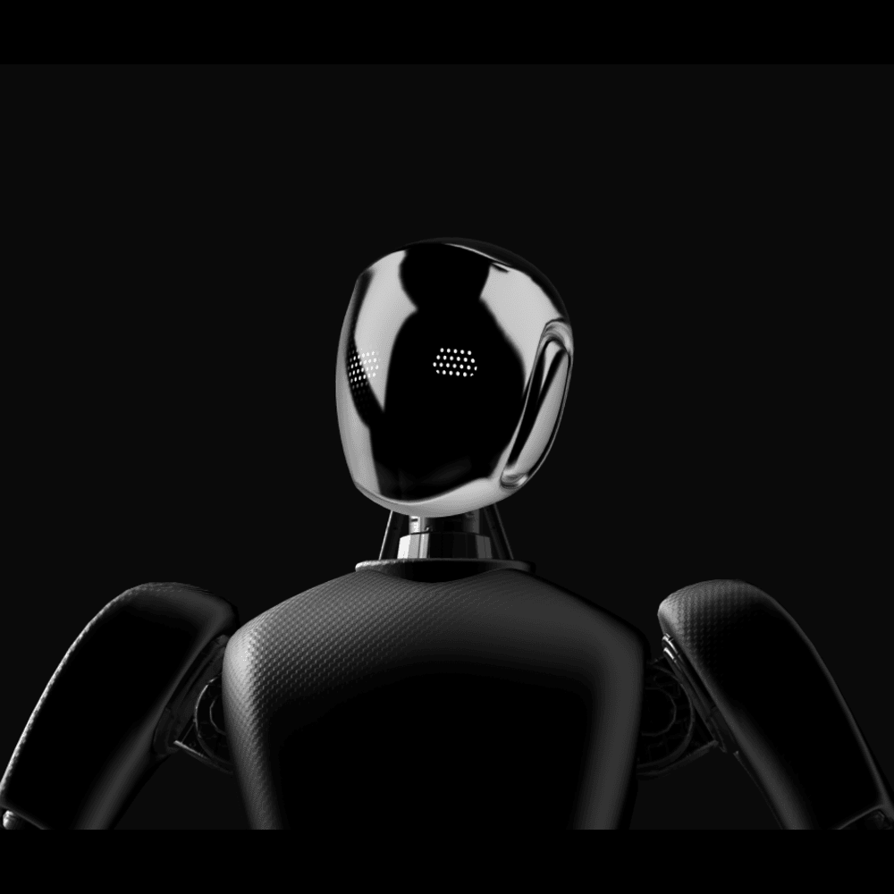

# Imagination Lab

**Current project logo:** project-logo.png

This project uses Three.js to create the 3D world, MediaPipe to track the hands position and implement the motions, Google's Gemini AI to understand and respond to what kids say, and ElevenLabs to make the characters talk back. Kids press the spacebar to speak, and the character answers their questions and chats with them in real-time. The actions that the kids are able to do in their 3D world are: change the environment, create new objects/characters, activate some animations, and completely remake the scene by the motion commands on the screen - using their hands with the camera on.

team-25

- Tony Montes ([@t-montes](https://github.com/t-montes))
- Isabela Rodriguez ([@isabelarodriguezp0415](https://github.com/isabelarodriguezp0415))
- Oscar Morales ([@oskcarsv](https://github.com/oskcarsv))

**Track:** 🦾 human enhancement